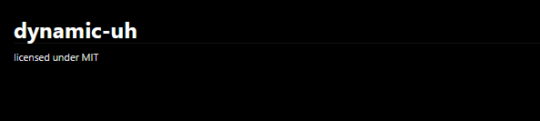

# Proplate 🛠⚙

<div>
    
    
</div>
<br>

Give up setting up the environment each time you begin a project using the same technology; instead, make a template once and utilize it for all upcoming projects.

## Table of contents

1. [Installation](#installation)
2. [Use a template to create a project](#use-a-template-to-create-a-project)
3. [Craft your own template](#craft-your-own-template)
   * [Ref](#ref)
   * [Learn by doing](#learn-by-doing)
     * [tiniest template configuration](#tiniest-template-config)
     * [args](#args)
     * [context binding](#context-binding)
   * [Some extras](#some-extras)

## Installation

Prerequisites: [git](https://git-scm.com/downloads)

You can download it from the [release](https://github.com/YumeT023/proplate/releases/tag/0.3.0) page.<br>
I recommend making it globally available in your terminal. <u>(wip: install.sh)</u>

## Use a template to create a project

```shell
proplate create --template <location> --dest <output_dir>
```

`location` could be a Github repository or a local directory

For the sake of testing, I'll leave this template [https://github.com/YumeT023/proplate-simple-npm-template](https://github.com/YumeT023/proplate-simple-npm-template) <br>
Run the following command to start your project from the above template:

```shell
proplate create --template https://github.com/YumeT023/proplate-simple-npm-template --dest your-project-name
```

NB: Add `--git` if you'd want **proplate** to initialize a git repository for you

At this point, ... talk to Proplate:D

## Craft your own template

### Ref

- Proplate template is a directory that contains a `meta.json`

### Learn by doing

The template for the example can be found at https://github.com/YumeT023/proplate/tree/master/examples/learn-by-doing

#### tiniest template config

The tiniest configuration is as follows:

```json
{
  "id": "initial-template",
  "args": []
}
```

<br>

#### args

What are `"args"` for?

> Proplate uses them to create an interactive prompt during template initialization.

There are two variants of input you can get with Proplate: `Select` and `Text`.

```json
"args": [
  {
    "key": "project_name",
    "q_type": "Text",
    "label": "Enter your project name"
  }
]
```

Text input is rendered as follow:


Let's try to add a select input for the license with some `options`

```json
"args": [
  {
    "key": "project_name",
    "q_type": "Text",
    "label": "Enter your project name"
  },
  {
    "key": "license",
    "q_type": "Select",
    "label": "Select a license for your project",
    "options": ["MIT", "BSD-2-Clause", "none"]
  }
]
```

Select input is rendered as follow:


... but now... what ? `args` is what:( ?

#### Context binding

**args** or **context** are used to replace the var binding in specific files called `dynamic files`

How to write dynamic files ?

... pretty straightforward: $var_name, in our case `$license`and`$project_name`

Let's add a file README.md dynamic file, as follows

_README.md_

```md
# $project_name

licensed under $license
```

run proplate

```shell
proplate create --template learn-by-doing --dest dynamic-uh
```

Lezz open the output `dynamic-uh/README.md`

`...`

We actually nailed it ✨



How to i tell proplate that I want to write `$not-binding` as is ?

just escape them -uh

_README.md_

```md
# $project_name

licensed under $license

hey proplate, leave this one \$not-binding
```

I mean...


You are free to create as many files as desired and add the bindings, **Proplate** will handle them

[more about dynamic files](#some-extras)

#### Additional operations

Sometimes, you want to do things beyond just replacing dynamic files. Well, Proplate's got you covered.

At the moment, proplate supports 2 basic `fs` operation: `Remove`, `Copy`

these operations are enumerated under `"additional_operations"`

... let's say we just want to delete something for no good reason

Add the file SIMPLY_DELETE to your template directory.

```json
{
  "additional_operations": [
    {
      "operations": [
        {
          "Remove": {
            "files": ["SIMPLY_DELETE"]
          }
        }
      ]
    }
  ]
}
```

You are free to add as many operations as desired under the `"operations"`

... but wait, `"additional_operations"` is kinda weird... and why don't you just omit the SIMPLY_DELETE file directly ?

Removing and copying become more practical when executed conditionally right ?? ... Proplate can do that!!

Let's modify our template a bit

add `MIT` to the `".proplate_aux_utils"` directory (this directory is ignored by default [more info](#some-extras)

_MIT_

**add the $author binding;)**

```
MIT License

Copyright (c) 2024 $author

...
```

Now, only copy the _MIT_ to the _LICENSE_ file when MIT license is selected

```json
{
  "args": [
    {
      "key": "author",
      "q_type": "Text",
      "label": "Who is da author"
    }
    ...
  ],
  "additional_operations": [
    {
      "conditions": [
        {
          "lhs": "$license",
          "op": "Eq",
          "rhs": "MIT"
        }
      ],
      "operations": [
        {
          "Copy": {
            "file": ".proplate_aux_utils/MIT",
            "dest": "LICENSE"
          }
        }
      ]
    }
    ...
  ]
}
```

```shell
proplate create --template learn-by-doing --dest additional-op-uh
```

supported conditional op are: `Eq`, `NotEq`

**-You might say-**

can't we just run some bash script-uh ? ... for your own security, **NO**

## Some extras

- `"dynamic_files"`: If you don't include this prop, proplate will treat the template files as dynamic.

  - For a larger template, you may want to specify exactly what the dynamic files are. You can enumerate them under the `"dynamic_files"` prop as follow
    you can enumerate "files" or "directories". However, at this point, the rest of the files/directories become static

    ```json
    {
      "dynamic_files": ["package.json", "directory"]
      ...
    }
    ```

- `"exclude"`: I told you earlier that the `".proplate_aux_utils"`. By default, (auxiliary) is ignored, which means it is not included in the template directly
  But maybe later, during "additional_operations"

  - You can also add your own auxiliary directory/file under the `"exclude"`.

    Note: `"meta.json"` and `".proplate_aux_utils"` is pre-excluded

    ```json
    {
      "exclude": [".git", "node_modules"]
      ...
    }
    ```

- `"args"`: Input of type `Text` may have a "default_value" prop, which proplate will use as a placeholder
